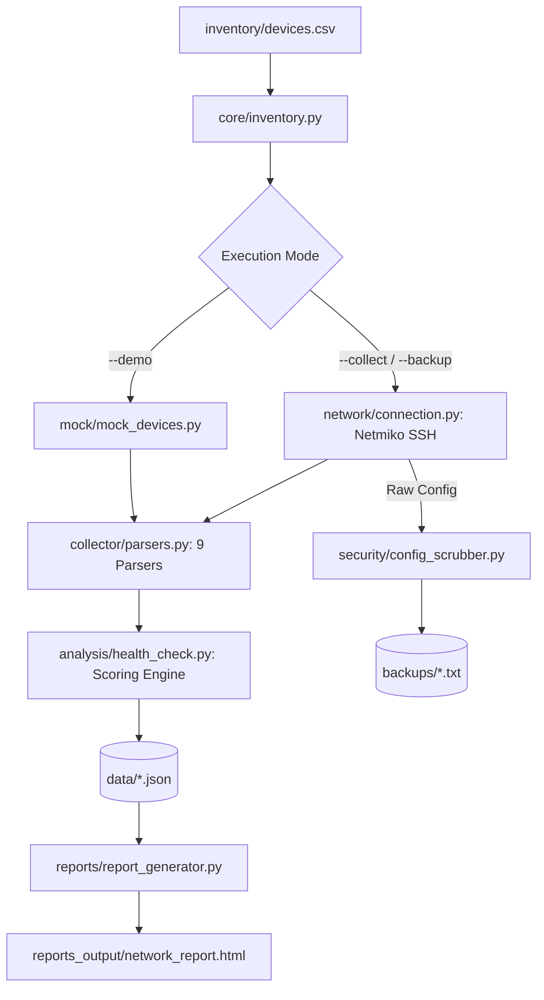

# 🌐 Cisco Network Automation Toolkit

[](https://www.python.org/)
[](tests/)
[](https://github.com/ktbyers/netmiko)
[](https://developer.cisco.com/pyats/)
[](security/)
[](LICENSE)
[]()

> **Automated network device management, multi-dimensional health analysis (0–100 scoring), credential-scrubbed configuration backups, and Cisco pyATS/Genie validation for Cisco IOS and IOS-XE infrastructures.**

---

## 📑 Table of Contents

- [Overview & Value Proposition](#-overview--value-proposition)
- [Key Features](#-key-features)
- [System Architecture](#-system-architecture)
- [Repository Structure](#-repository-structure)
- [Quick Start (Zero Hardware Required)](#-quick-start-zero-hardware-required)
- [Execution Modes & CLI Reference](#-execution-modes--cli-reference)
  - [Mode 1: Offline Demo & Health Audit (`--demo`)](#mode-1-offline-demo--health-audit---demo)
  - [Mode 2: Automated Config Backup & Scrubbing (`--backup`)](#mode-2-automated-config-backup--scrubbing---backup)
  - [Mode 3: Live Device Collection via SSH (`--collect`)](#mode-3-live-device-collection-via-ssh---collect)
  - [Mode 4: Cisco pyATS/Genie Validation (`--validate`)](#mode-4-cisco-pyatsgenie-validation---validate)
  - [Mode 5: HTML Report Re-generation (`--report`)](#mode-5-html-report-re-generation---report)
  - [Mode 6: CLI Quick Health Summary (`show_health.py`)](#mode-6-cli-quick-health-summary-show_healthpy)
- [Health Scoring Algorithm & Rules](#-health-scoring-algorithm--rules)
  - [OSPF Adjacency & DROTHER 2WAY Handling](#ospf-adjacency--drother-2way-handling)
- [Security Architecture & Config Sanitization](#-security-architecture--config-sanitization)
- [Parsed Cisco IOS Commands Reference](#-parsed-cisco-ios-commands-reference)
- [Testing & Quality Assurance (151 Tests)](#-testing--quality-assurance-151-tests)
- [Device Inventory Management](#-device-inventory-management)
- [pyATS & Genie Validation Framework](#-pyats--genie-validation-framework)
- [Platform Compatibility & Lab Setup](#-platform-compatibility--lab-setup)
- [Troubleshooting & FAQ](#-troubleshooting--faq)
- [Technical Audits & Architecture Documentation](#-technical-audits--architecture-documentation)
- [License & Authors](#-license--authors)

---

## 🎯 Overview & Value Proposition

In enterprise networks managing dozens or hundreds of Cisco routers and switches, manual CLI audits via SSH are slow, error-prone, and unscalable. 

The **Cisco Network Automation Toolkit** provides a complete, robust automation pipeline that connects to network devices, executes diagnostic commands, parses unformatted CLI text into structured JSON models, evaluates real-time device health across 7 weighted dimensions, scrubs sensitive credentials from running configs, and renders an executive HTML5 dashboard.

### ⏱️ The Automation Advantage

```
┌────────────────────────────────────────┐       ┌────────────────────────────────────────┐
│           BEFORE (Manual CLI)          │       │         AFTER (Automated Pipeline)     │
├────────────────────────────────────────┤       ├────────────────────────────────────────┤
│ • SSH into R1, R2, R3, SW1, SW2...     │       │ • Run: python main.py --demo (or live) │
│ • Manually run 9 commands per box      │  ───► │ • Automatic concurrent/batched SSH     │
│ • Eyeball routing tables & OSPF states │       │ • Structured regex parsing to JSON     │
│ • Write manual notes on paper/Word     │       │ • Weighted 0–100 health scoring        │
│ • Passwords exposed in raw configs     │       │ • Auto-scrubbed configs (<REDACTED>)   │
│ • Time: 30–60+ minutes per audit       │       │ • Executive HTML5 Dashboard in < 5 sec │
└────────────────────────────────────────┘       └────────────────────────────────────────┘
```

### 🏆 Engineering Skills Demonstrated

| Competency | Implementation in this Project |
|---|---|
| **Python Network Automation** | End-to-end data pipeline using object-oriented, modular design |
| **Cisco CLI & Protocols** | Deep parsing of IOS outputs: OSPF states (DR/BDR/DROTHER), CPU/Memory, VLANs, MAC tables |
| **Resilient SSH Layer** | `Netmiko` & `Paramiko` connection management with retry logic, timeouts, and custom exceptions |
| **Enterprise Security** | Multi-pattern regex config sanitization, environment variable credential sourcing, `.env` isolation |
| **Validation Frameworks** | Cisco `pyATS` / `Genie` structured testbed validation (PASS/FAIL tests) |
| **Automated Testing** | **151 unit, edge-case, and integration tests** ensuring zero regressions |
| **Executive Reporting** | `Jinja2` templating engine generating responsive, searchable HTML5 dashboards |

---

## ✨ Key Features

- **🚀 100% Offline Demo Mode**: Test and evaluate the entire pipeline with realistic mock devices without needing any physical Cisco hardware or virtual labs.
- **📊 Multi-Dimensional Health Scoring (0–100)**: Evaluates device reachability, interface health, OSPF neighbor states, CPU utilization, memory pressure, VLAN configuration, and routing tables.
- **🧠 Protocol-Aware OSPF Logic**: Intelligently accounts for OSPF broadcast network topology, recognizing `2WAY/DROTHER` as valid behavior rather than falsely penalizing device health.
- **🔒 Zero-Leak Credential Scrubbing**: Automatically sanitizes `enable secrets`, user passwords, SNMP communities, ISAKMP pre-shared keys, and TACACS/RADIUS keys before saving backups.
- **📱 Responsive HTML5 Dashboard**: Modern, glassmorphic executive dashboard generated via Jinja2 with device summary cards, alert severity badges, and detailed status tables.
- **🧪 Industry-Standard pyATS Integration**: Ready-to-use validation runner for Cisco pyATS/Genie testbeds on Linux/WSL environments.
- **🛡️ 151 Automated Tests**: Full test suite covering regex parsers, edge cases (route types, subnets, zero division), connection retries, inventory parsing, and security scrubbers.

---

## 🏗️ System Architecture

```
                                  ┌──────────────────────────┐
                                  │       main.py CLI        │
                                  │  (Unified Entry Point)   │
                                  └─────────────┬────────────┘
                                                │
                 ┌──────────────────────────────┼──────────────────────────────┐
                 ▼                              ▼                              ▼
      ┌────────────────────┐         ┌────────────────────┐         ┌────────────────────┐
      │     core/          │         │    network/        │         │    security/       │
      │ • inventory.py     │         │ • connection.py    │         │ • config_          │
      │ • credentials.py   │         │ • commands.py      │         │   scrubber.py      │
      │ • logger.py        │         │ • exceptions.py    │         │ (Regex Redaction)  │
      └──────────┬─────────┘         └──────────┬─────────┘         └──────────┬─────────┘
                 │                              │                              │
                 └──────────────────────┐       │       ┌──────────────────────┘
                                        ▼       ▼       ▼
                                ┌────────────────────────────────┐
                                │          collector/            │
                                │ • info_collector.py            │
                                │ • parsers.py (9 CLI Parsers)   │
                                └───────────────┬────────────────┘
                                                │
                                                ▼
                                ┌────────────────────────────────┐
                                │          analysis/             │
                                │ • health_check.py (0-100 Score)│
                                └───────────────┬────────────────┘
                                                │
                 ┌──────────────────────────────┼──────────────────────────────┐
                 ▼                              ▼                              ▼
      ┌────────────────────┐         ┌────────────────────┐         ┌────────────────────┐
      │      data/         │         │ reports_output/    │         │     backups/       │
      │   <device>.json    │         │ network_report.html│         │ <host>_<date>.txt  │
      │ (Structured Data)  │         │ (Jinja2 Dashboard) │         │ (Scrubbed Configs) │
      └────────────────────┘         └────────────────────┘         └────────────────────┘
```

### 🔄 Data Processing Lifecycle



---

## 📂 Repository Structure

```
cisco-network-automation/
├── main.py                     # Unified CLI entry point for all modes
├── show_health.py              # Quick terminal health score and alert viewer
├── requirements.txt            # Core production dependencies (Netmiko, Jinja2, Rich, etc.)
├── requirements-pyats.txt      # Optional Cisco pyATS & Genie dependencies (Linux/WSL)
├── .env.example                # Template for safe credential configuration
├── .gitignore                  # Git ignore rules (protects .env, backups, logs, data)
│
├── analysis/                   # Health analysis and scoring engine
│   └── health_check.py         # 7-dimension weighted 0–100 scoring & alert engine
│
├── backup/                     # Configuration backup orchestrator
│   └── backup_tool.py          # Standalone/modular backup runner with retry logic
│
├── collector/                  # Data collection and command parsing
│   ├── info_collector.py       # SSH collection workflow and JSON exporter
│   └── parsers.py              # Pure regex parsers for 9 Cisco IOS commands
│
├── config/                     # Centralized settings and constants
│   └── settings.py             # Paths, thresholds, timeouts, and scoring weights
│
├── core/                       # Shared utility infrastructure
│   ├── credentials.py          # Multi-source credential resolver (Prompt/Env/.env)
│   ├── inventory.py            # CSV device inventory parser and validator
│   └── logger.py               # Standardized console and file logger
│
├── network/                    # Network abstraction and connection layer
│   ├── commands.py             # Cisco IOS command definitions
│   ├── connection.py           # Netmiko DeviceConnector wrapper with retries
│   └── exceptions.py           # Domain exceptions (DeviceUnreachableError, etc.)
│
├── security/                   # Security and sanitization
│   └── config_scrubber.py      # Regex redaction of credentials in running configs
│
├── validation/                 # Cisco pyATS / Genie validation
│   ├── pyats_runner.py         # Testbed test runner (Connectivity, VLAN, OSPF, etc.)
│   ├── testbed.yaml.example    # Example testbed definition file
│   └── README.md               # pyATS setup guide and instructions
│
├── reports/                    # HTML report compilation
│   └── report_generator.py     # Jinja2 template renderer
│
├── templates/                  # Presentation templates
│   └── report.html.j2          # Executive HTML5 network health dashboard template
│
├── mock/                       # Mock data for offline evaluation
│   └── mock_devices.py         # Simulated outputs for R1, R2, R3, SW1, SW2
│
├── inventory/                  # Target device inventory
│   └── devices.csv             # CSV device list (hostname, IP, role, enabled)
│
├── docs/                       # Architecture, security, and lab testing documentation
│   ├── architecture-audit.md   # Architectural design and refactoring audit
│   ├── cisco-validation-review.md # pyATS validation review and guidelines
│   ├── failure-testing.md      # Controlled lab failure testing manual
│   └── security-audit.md       # Security findings and credential hygiene review
│
├── tests/                      # Automated test suite (151 tests)
│   ├── test_config_scrubber.py # 13 tests: Config credential scrubbing
│   ├── test_connection.py      # 8 tests: Connection manager & retry mechanics
│   ├── test_health_check.py    # 32 tests: Scoring rules & alert generation
│   ├── test_integration.py     # 26 tests: End-to-end collection & report pipeline
│   ├── test_inventory.py       # 5 tests: CSV loading and validation
│   ├── test_parsers.py         # 29 tests: Pure CLI command regex parsers
│   └── test_parsers_edge_cases.py # 38 tests: Route types, edge formats, zero-div
│
├── data/                       # [Runtime] Structured device JSON output (gitignored)
├── backups/                    # [Runtime] Sanitized configuration backups (gitignored)
├── logs/                       # [Runtime] Execution log files (gitignored)
└── reports_output/             # [Runtime] Generated HTML dashboards (gitignored)
```

---

## 🚀 Quick Start (Zero Hardware Required)

You can run and test the complete pipeline immediately without any Cisco equipment.

### Step 1: Clone the repository

```bash
git clone https://github.com/rohitr01/Cisco-Network-Automation.git
cd Cisco-Network-Automation
```

### Step 2: Install dependencies

```bash
# Recommended: Create and activate a virtual environment
python -m venv venv

# Windows:
venv\Scripts\activate
# Linux/macOS:
source venv/bin/activate

# Install required packages
pip install -r requirements.txt
```

### Step 3: Run the Demo Mode

```bash
python main.py --demo
```

**What happens instantly:**
1. Loads 5 mock devices (`R1`, `R2`, `R3`, `SW1`, `SW2`) from `inventory/devices.csv`.
2. Parses simulated Cisco outputs across all 9 diagnostic commands.
3. Calculates a 0–100 health score for every device.
4. Generates structured JSON files in `data/`.
5. Builds an interactive HTML dashboard at `reports_output/network_report.html`.
6. Prints a formatted Rich summary table in your terminal.

---

## 💻 Execution Modes & CLI Reference

`main.py` provides a unified CLI with specialized operational modes:

### Mode 1: Offline Demo & Health Audit (`--demo`)

Runs full collection, health scoring, JSON export, and HTML report generation using offline mock devices:

```bash
python main.py --demo
```

**Sample Terminal Output:**
```
======================================================================
  NETWORK HEALTH SCORE SUMMARY
======================================================================
Device         Score  Grade  Status         Top Alert
----------------------------------------------------------------------
R1           100/100  A      HEALTHY        GigabitEthernet0/2 is administratively down
R2            90/100  A      HEALTHY        High CPU utilisation: 85.0% (1-min avg)
R3            80/100  B      GOOD           OSPF has no established neighbors
SW1           70/100  C      DEGRADED       High memory utilisation: 88.0%
SW2            0/100  F      UNREACHABLE    Device is unreachable
----------------------------------------------------------------------
```

---

### Mode 2: Automated Config Backup & Scrubbing (`--backup`)

Backs up `show running-config` from devices and scrubs all sensitive credentials before writing to disk:

```bash
# Demo backup (mock devices):
python main.py --demo --backup

# Live network backup:
python main.py --backup --prompt
```

**Generated Backup Artifacts:**
- Output directory: `backups/<hostname>_<YYYY-MM-DD>.txt`
- Passwords, hashes, and SNMP community strings are replaced with `<REDACTED>`.

---

### Mode 3: Live Device Collection via SSH (`--collect`)

Connects to real Cisco routers and switches in your lab or production network via Netmiko:

```bash
# Option A: Interactive credential prompt (recommended for interactive use)
python main.py --collect --prompt

# Option B: Using .env file
cp .env.example .env
# Edit .env with your NET_USERNAME, NET_PASSWORD, NET_SECRET
python main.py --collect

# Option C: Custom inventory CSV file
python main.py --collect --prompt --inventory /path/to/custom_devices.csv
```

---

### Mode 4: Cisco pyATS/Genie Validation (`--validate`)

Executes structured PASS/FAIL validation against a Cisco pyATS testbed (Linux / WSL only):

```bash
# 1. Install pyATS packages
pip install -r requirements-pyats.txt

# 2. Configure your testbed
cp validation/testbed.yaml.example validation/testbed.yaml
# Edit validation/testbed.yaml with your device IPs and credentials

# 3. Run validation suite
python main.py --validate
```

---

### Mode 5: HTML Report Re-generation (`--report`)

Re-compiles the HTML dashboard from existing `data/*.json` files without re-connecting to network devices:

```bash
python main.py --report
```

---

### Mode 6: CLI Quick Health Summary (`show_health.py`)

A lightweight CLI viewer to inspect parsed health scores, sub-dimension weight bars, and active alerts directly in the terminal:

```bash
python show_health.py
```

---

## 📊 Health Scoring Algorithm & Rules

Each device receives an objective health score (0–100) calculated across 7 weighted dimensions:

| Dimension | Max Points | Evaluation Logic | Penalty Criteria |
|---|:---:|---|---|
| **Reachable** | `20` | SSH connectivity test | Complete failure (`0/100`) if unreachable |
| **Interfaces** | `20` | `show ip interface brief` | Points deducted for non-admin interfaces in `down/down` state |
| **OSPF Neighbors** | `20` | `show ip ospf neighbor` | Deductions for missing neighbors or neighbors stuck in `INIT`/`ATTEMPT` |
| **CPU Utilization** | `10` | `show processes cpu sorted` | Warning if CPU > 75%, Critical deduction if CPU > 85% |
| **Memory Pressure** | `10` | `show processes memory sorted` | Warning if Memory > 80%, Critical deduction if Memory > 90% |
| **VLAN Integrity** | `10` | `show vlan brief` (Switches) | Deductions if VLAN database is unconfigured or corrupted |
| **Routing Table** | `10` | `show ip route` (Routers) | Deductions if routing table is empty or missing expected default/dynamic routes |

### 📈 Health Grading Scale

| Score | Grade | Status Classification | Action Required |
|---|:---:|---|---|
| **90 – 100** | `A` | **HEALTHY** | No immediate action required |
| **75 – 89** | `B` | **GOOD** | Minor warnings observed; review logs |
| **60 – 74** | `C` | **DEGRADED** | Action recommended; potential bottleneck or neighbor loss |
| **40 – 59** | `D` | **CRITICAL** | Immediate attention required; major protocol or link down |
| **0 – 39** | `F` | **UNREACHABLE / FAILING** | Device unreachable or multiple critical outages |

### OSPF Adjacency & DROTHER 2WAY Handling

On multi-access broadcast networks (e.g., Ethernet segments), OSPF establishes:
- **FULL** adjacencies with the Designated Router (`DR`) and Backup Designated Router (`BDR`).
- **2WAY** neighbor state between non-designated routers (`DROTHER`).

> [!IMPORTANT]
> Naive automation scripts often misclassify `2WAY` states on DROTHER devices as network failures. This toolkit implements **context-aware OSPF analysis**: `2WAY/DROTHER` is parsed as normal operation (`INFO` status) and does not penalize the health score. States such as `INIT`, `EXSTART`, or missing neighbors correctly trigger `CRITICAL` penalties.

---

## 🔒 Security Architecture & Config Sanitization

Network automation scripts must never expose administrative credentials. This project enforces strict security guardrails:

### 🛡️ Regex Credential Redaction Engine

When `backup_tool.py` or `main.py --backup` runs, `security/config_scrubber.py` applies high-precision regular expressions to redact secret material:

```
[RAW CONFIG FROM DEVICE]                         [SAVED TO BACKUPS/*.TXT]
enable secret 5 $1$mERr$hx5rVt7...      ───►     enable secret 5 <REDACTED>
username admin privilege 15 secret 0 cisco ───► username admin privilege 15 secret 0 <REDACTED>
snmp-server community NetOps2026 RO     ───►     snmp-server community <REDACTED> RO
crypto isakmp key SecretVPNKey address  ───►     crypto isakmp key <REDACTED> address
tacacs-server key 7 08324C4A0D10        ───►     tacacs-server key 7 <REDACTED>
```

### 🔑 Credential Sourcing Hierarchy

```
   1. Interactive Prompt (--prompt)  ──► In-memory only (Never written to disk)
   2. Environment Variables          ──► export NET_USERNAME=admin
   3. .env File (Gitignored)         ──► Read via python-dotenv
```

### 🚫 Git Protection Rules

The `.gitignore` strictly isolates runtime artifacts and secrets:
- `.env` and `*.env`
- `backups/*.txt`
- `data/*.json`
- `logs/*.log`
- `reports_output/*.html`
- `validation/testbed.yaml`

---

## 📡 Parsed Cisco IOS Commands Reference

The parsing engine in `collector/parsers.py` converts raw CLI outputs from 9 essential commands into structured, type-cast Python dictionaries:

| # | Cisco IOS Command | Parsed Attributes | Target Platform |
|---|---|---|---|
| 1 | `show version` | `version`, `uptime_str`, `uptime_hours`, `hostname`, `model`, `serial_numbers` | Routers & Switches |
| 2 | `show ip interface brief` | `interfaces`: list of `{interface, ip_address, status, protocol, admin_down}` | Routers & Switches |
| 3 | `show vlan brief` | `vlans`: list of `{vlan_id, name, status, ports}` | Switches |
| 4 | `show mac address-table` | `mac_table`: list of `{vlan, mac_address, type, port}` | Switches |
| 5 | `show ip route` | `routes`: list of `{protocol, network, mask, next_hop, interface}` | Routers |
| 6 | `show ip ospf neighbor` | `neighbors`: list of `{neighbor_id, priority, state, role, address, interface}` | Routers |
| 7 | `show processes cpu sorted` | `cpu_1min`, `cpu_5min`, `top_processes` | Routers & Switches |
| 8 | `show processes memory sorted`| `total_bytes`, `used_bytes`, `free_bytes`, `used_percent` | Routers & Switches |
| 9 | `show running-config` | `hostname`, configuration text (sanitized) | Routers & Switches |

---

## 🧪 Testing & Quality Assurance (151 Tests)

The test suite provides comprehensive coverage without requiring real Cisco hardware or network connectivity.

### Running the Test Suite

```bash
# Run all 151 unit and integration tests
python -m unittest discover tests/ -v

# Run a specific test module
python -m unittest tests/test_parsers.py -v
```

### 📋 Test Module Breakdown

| Test Module | Test Count | Focus Area |
|---|:---:|---|
| [`test_parsers.py`](tests/test_parsers.py) | **29** | Validates regex extraction against standard Cisco IOS command outputs |
| [`test_parsers_edge_cases.py`](tests/test_parsers_edge_cases.py) | **38** | Edge cases: OSPF route types (IA, E1, E2), BGP, zero memory division, interface naming variants |
| [`test_health_check.py`](tests/test_health_check.py) | **32** | 0–100 scoring logic, OSPF 2WAY handling, threshold penalties, alert severities |
| [`test_integration.py`](tests/test_integration.py) | **26** | End-to-end workflows: collect → parse → score → export JSON → render HTML |
| [`test_config_scrubber.py`](tests/test_config_scrubber.py) | **13** | Regex sanitization across 8 sensitive credential and key patterns |
| [`test_connection.py`](tests/test_connection.py) | **8** | SSH connection lifecycle, retry counts, timeout handling, custom exceptions |
| [`test_inventory.py`](tests/test_inventory.py) | **5** | CSV parsing, missing column validation, disabled device handling |
| **Total Automated Tests** | **151** | **100% Passing** |

---

## 📋 Device Inventory Management

Device targets are defined in `inventory/devices.csv`:

```csv
hostname,ip,device_type,role,enabled
R1,192.168.1.1,cisco_ios,router,true
R2,192.168.1.2,cisco_ios,router,true
R3,192.168.1.3,cisco_ios,router,true
SW1,192.168.1.10,cisco_ios,switch,true
SW2,192.168.1.11,cisco_ios,switch,false
```

### Column Specifications

- `hostname` *(Required)*: Unique identifier for the device (used in reports and backup naming).
- `ip` *(Required)*: Management IPv4/IPv6 address.
- `device_type` *(Optional)*: Netmiko driver (defaults to `cisco_ios`).
- `role` *(Optional)*: `router` or `switch` (controls device-specific audit rules).
- `enabled` *(Optional)*: Set to `false` to skip the device during execution without deleting its record.

---

## 🔬 pyATS & Genie Validation Framework

For organizations utilizing Cisco's official test automation framework, the `validation/` module integrates **pyATS** and **Genie**.

### Comparison: Netmiko vs. pyATS

| Feature | Netmiko Pipeline (`--collect`) | pyATS Pipeline (`--validate`) |
|---|---|---|
| **Primary Goal** | Telemetry collection, 0–100 health scoring, HTML reports | Strict PASS/FAIL assertions against network state |
| **Parsing Engine** | Custom regex parsers (`collector/parsers.py`) | Cisco Genie official parsers |
| **OS Compatibility** | Windows, macOS, Linux | Linux / WSL (pyATS requirement) |
| **Output** | `data/*.json` & `network_report.html` | Console test results & pyATS logs |

### pyATS Testbed Template (`validation/testbed.yaml`)

```yaml
testbed:
  name: Cisco-Network-Lab

devices:
  R1:
    os: ios
    type: router
    connections:
      cli:
        protocol: ssh
        ip: 192.168.1.1
    credentials:
      default:
        username: '%ENV{NET_USERNAME}'
        password: '%ENV{NET_PASSWORD}'
```

---

## 🌐 Platform Compatibility & Lab Setup

### Compatible Network Operating Systems

- ✅ **Cisco IOS 15.x** (Full Support)
- ✅ **Cisco IOS-XE 16.x & 17.x** (Catalyst 9300/9500, ISR 4000, CSR1000v, C8000v)
- ❌ **Cisco NX-OS / IOS-XR / ASA** *(Different CLI output structures)*
- ❌ **Cisco Packet Tracer** *(Packet Tracer does not support standard Netmiko/Paramiko SSH automation)*

### Recommended Lab Environments

- **Cisco Modeling Labs (CML)** (Recommended)
- **GNS3** (Tested with IOSv / IOSv-L2 appliances)
- **EVE-NG** (Tested with Cisco IOL / Dynamips / CSR1000v)
- **Physical Hardware** (Catalyst 2960/3560/3750/3850/9200/9300, Cisco 1900/2900/3900/4000 ISRs)

---

## ❓ Troubleshooting & FAQ

<details>
<summary><b>1. Error: <code>NetmikoTimeoutException</code> or connection timed out</b></summary>

- Verify management IP reachability via `ping <device_ip>`.
- Ensure SSH is configured on the Cisco device (`ip ssh version 2`, `transport input ssh` under `line vty`).
- Check firewall / ACL rules between your workstation and the target device.
</details>

<details>
<summary><b>2. Error: <code>NetmikoAuthenticationException</code></b></summary>

- Double-check your username, password, and enable secret.
- If using special characters in passwords with `.env`, ensure proper quotation or use interactive `--prompt` mode.
</details>

<details>
<summary><b>3. Why does pyATS validation fail on Windows?</b></summary>

- Cisco pyATS core libraries natively require POSIX system calls and only run on Linux or macOS.
- On Windows, install and run pyATS inside **WSL (Windows Subsystem for Linux)**. The rest of the toolkit works seamlessly on native Windows.
</details>

<details>
<summary><b>4. How do I modify health scoring thresholds?</b></summary>

- Edit `config/settings.py` to adjust weights (`WEIGHT_REACHABLE`, `WEIGHT_INTERFACES`, etc.) or threshold limits (`CPU_WARN_THRESHOLD`, `MEM_WARN_THRESHOLD`).
</details>

---

## 📚 Technical Audits & Architecture Documentation

Detailed architectural reports, security assessments, and lab failure guides are available in the [`docs/`](docs/) directory:

- 📖 [**Architecture Audit**](docs/architecture-audit.md): Deep dive into modular design patterns, separation of concerns, and component coupling.
- 🔒 [**Security Audit**](docs/security-audit.md): Complete analysis of credential hygiene, sanitization regexes, and vulnerability mitigations.
- 🧪 [**Failure Testing Guide**](docs/failure-testing.md): Controlled failure test procedures for OSPF drops, interface shutdowns, and unreachable nodes.
- 📋 [**Cisco Validation Review**](docs/cisco-validation-review.md): Detailed comparison and review of pyATS testbed validation.

---

## 📄 License & Authors

This project is licensed under the **MIT License** — see the [LICENSE](LICENSE) file for details.

### 👤 Author

**Rohit Rohaj**
- GitHub: [@rohitr01](https://github.com/rohitr01)
- Repository: [Cisco-Network-Automation](https://github.com/rohitr01/Cisco-Network-Automation)# Cisco-Network-Automation

